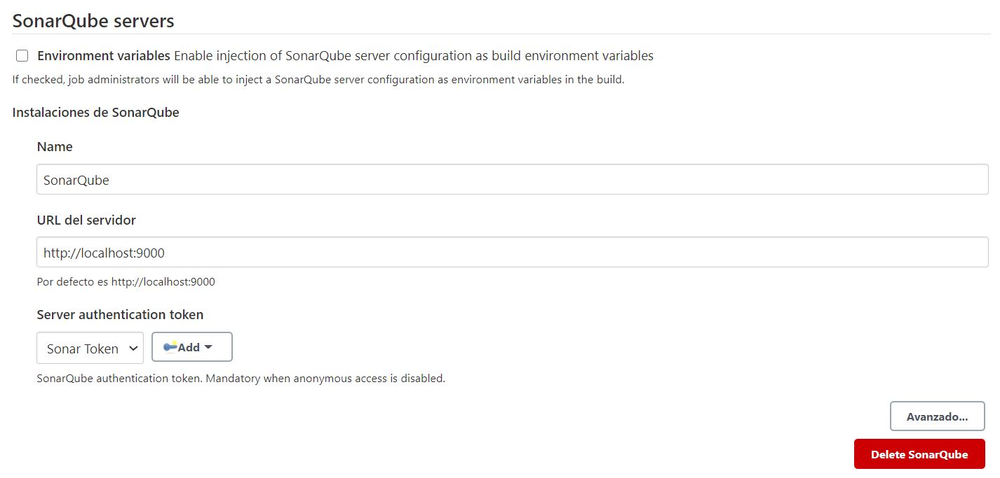
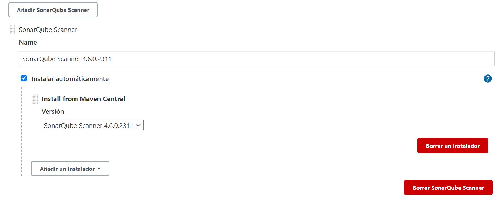

# :family_man_boy_boy::family_man_girl:Integración con Slack :family_man_girl::family_man_boy_boy:

## :arrow_forward: Objetivo: Integrar SonarQube en nuestro proyecto con la finalidad de que todo el equipo esté al tanto de la calidad del código.

### :book: Pasos a seguir:

- Descargar SonarQube en nuestra Raspberry y extraerlo en donde queramos, para este tutorial vamos a tomar la ruta "/home/pi/sonarqube", para ello renombramos la carpeta "sonarquebe-x.x.x.xxxxx" a sonar, y el "sonarquebe-application-x.x.x.xxxxx.jar" que se encuentra dentro de la carpeta ""/sonarquebe/lib" a "sonar.jar". 

- Iniciar sonar cada vez que se arranca la Raspberry, para ello editamos el fichero rc.local que se encuentra en /etc:

  `sudo nano /etc/rc.local`

  Antes del "exit 0" añadimos la siguiente linea:

  `java -jar /home/pi/sonarquebe/lib/sonar.jar`

  

  Ahora ya podemos iniciar sesión en SonarQuebe introduciendo en el navegador la ip de nuestra Raspberry seguido de :9000.

  La primera vez que entramos el usuario y contraseña por defecto es: "admin" . 

  

- Instalar el plugin "SonarQuebe Scanner" en el aparatado Plugins de Jenkins.

  

  

- Ahora vamos a añadir el Token que nos va a permitir establecer la conexión entre Jenkins y SonarQube, para ello vamos a Administración :arrow_right: Security. Veremos el usuario admin, y un apartado "Tokens", desplegamos las opción y generamos uno nuevo con un nombre, copiaremos el valor del Token al portapapeles para emplearlo mas tarde.

   

  

- Ya con nuestro Token en el portapapeles vamos a configurar el servidor Jenkins. Vamos a la opción :gear: Configurar el sistema, y al final de la configuración nos encontramos lo siguiente:

  

  - Introducimos el nombre que le queramos dar, en mi caso "SonarQube", la URL donde se aloja nuestro servidor seguido del puerto, y por ultimo añadimos un nuevo token, es un "Secret text" con el token obtenido del servidor de Sonar.

    

- Ahora vamos a configurar el "scanner" para SonarQube. Vamos a la opción :hammer:Global Tool Configuration, y añadiremos la versión del scanner que vamos a utilizar y un nombre (Yo recomiendo el mismo, ya que posteriormente se escribirá en el Jenkinsfile y asi sabemos siempre la versión del scanner).

   

- Ahora vamos a hablar de numerosos problemas que pueden surgir durante la instalación, por ello creemos que es necesario hablar sobre como funciona Jenkins con Sonar.

  

  

  :red_circle: En color rojo tenemos nuestro servidor Jenkins con sus "Stages", en este caso nos vamos a centrar en los dos últimos.

  Stage Test, se encarga de comprobar si se pasan los tests, pero algo cambia con respecto a las versiones anteriores. Ahora los test se lanzan con el comando "npm run coverage", lanza los tests y analiza la cobertura del proyecto generando una carpeta "coverage" y dentro un fichero "lcov.info".

  

  :blue_heart: En azul tenemos el servidor SonarQube, que analiza la calidad del código y muestra la cobertura del proyecto gracias al fichero "lcov.info" que le ofrece Jenkins.

  

- Por último tenemos que añadir un archivo de configuración de SonarQube en nuestro proyecto, se encuentra en el repositorio y se tiene que llamar "sonar-project.properties".


  

### 	:eye: Análisis del JenkinsFile :eye:

```
pipeline {
  agent any

  tools {nodejs "node"}

  stages {
    stage('Install dependencies') {
      steps {
        sh 'npm install'
        slackSend (color: '#00FF00', message: "Instalación de dependencias")
      }
    }
     
    stage('Test') {
      steps {
      /*
      Este step genera el fichero que necesita Sonar para analizar la cobertura del projecto (lcov.info).
      */
         sh 'npm run coverage'
         slackSend (color: '#00FF00', message: "Tests")
      }
    }
	/*
	Inicia el scanner con la versión que añadimos en la configuración (SonarQube Scanner 4.6.0.2311).
	En la linea que contiene: "withSonarQubeEnv('SonarQube')", SonarQube es el nombre que le dimos a nuestro servidor.
	*/
    stage('SonarQube analysis') {
        steps {
            script {
                scannerHome = tool 'SonarQube Scanner 4.6.0.2311'
            }
            withSonarQubeEnv('SonarQube') {
            sh "${scannerHome}/bin/sonar-scanner"
            }
        }
    }
    
  }
  post {
    success{
        slackSend (color: '#00FF00', message: ":white_check_mark:INTEGRACIÓN CORRECTA :white_check_mark:")
    }

    failure {
        slackSend (color: '#00FF00', message: ":red_circle: INTEGRACIÓN INCORRECTA :red_circle:")
    }

  }
}

```

### 	:eye: Análisis del sonar-project.properties :eye:

```properties
##Clave unica de proyecto.
sonar.projectKey=node-jenkins
##Nombre que le queramos dar.
sonar.projectName=Simple JavaScript project analyzed with the SonarQube Runner
##Versión.
sonar.projectVersion=1.0
##Carpetas que vamos a analizar.
sonar.sources=app
##Lenguaje empleado.
sonar.language=javascript
##Codificación de los archivos.
sonar.sourceEncoding=UTF-8
sonar.dynamicAnalysis="reuseReports"
##Lugar donde se encuentra nuestro fichero de covertura.
sonar.javascript.lcov.reportPaths="coverage/lcov.info"

```


Si todo funcionó correctamente después de ejecutar la tarea en el servidor de Jenkins deberíamos ver lo siguiente al autenticarnos en nuestro servidor de SonarQube:

